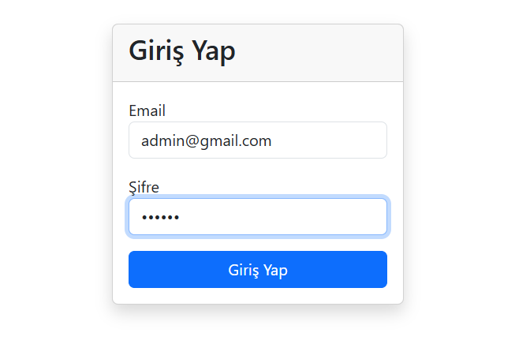
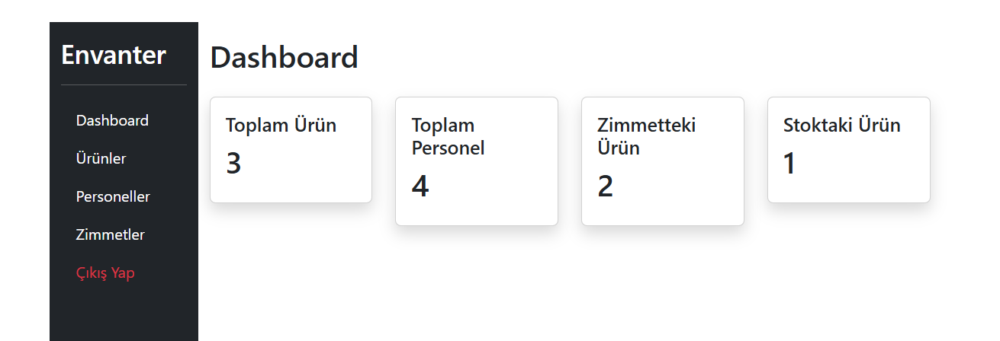
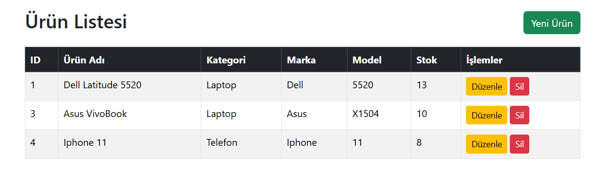
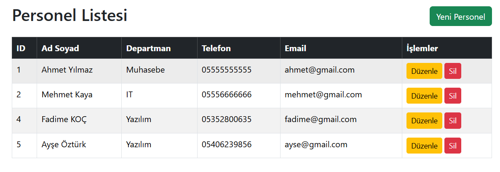
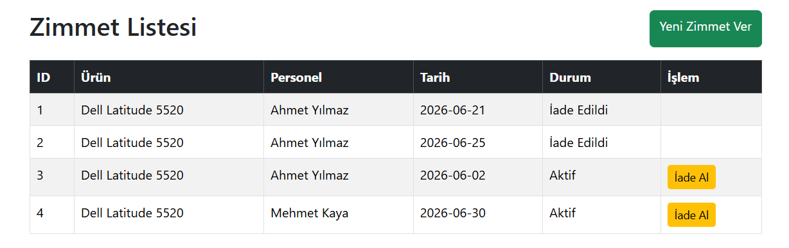

#  Inventory Management System

Flask ve MySQL kullanılarak geliştirilmiş bir **Şirket Envanter Yönetim Sistemi**.

Bu proje; ürün, personel ve zimmet yönetimini sağlayan kurumsal bir stok takip sistemidir.

---

##  Proje Özellikleri

###  Kullanıcı Sistemi
- Login / Logout
- Flask-Login ile oturum yönetimi

###  Ürün Yönetimi (CRUD)
- Ürün ekleme
- Ürün listeleme
- Ürün güncelleme
- Ürün silme

###  Personel Yönetimi (CRUD)
- Personel ekleme
- Personel listeleme
- Personel güncelleme
- Personel silme

### Zimmet Yönetimi
- Ürünleri personele zimmetleme
- Stok kontrolü
- İade sistemi
- Aktif zimmet takibi

###  Dashboard
- Toplam ürün sayısı
- Toplam personel sayısı
- Aktif zimmet sayısı
- Stok durumu

---

##  Kullanılan Teknolojiler

- Python 3
- Flask
- Flask-Login
- Flask-SQLAlchemy
- MySQL
- HTML / CSS
- Bootstrap 5

---

##  Proje Yapısı

inventory-management-system/
│
├── app.py
├── config.py
├── requirements.txt
│
├── models/
│ ├── user.py
│ ├── product.py
│ ├── employee.py
│ └── assignment.py
│
├── templates/
│ ├── auth/
│ ├── dashboard/
│ ├── products/
│ ├── employees/
│ └── assignments/


---

##  Kurulum

### 1. Projeyi klonla
```bash
git clone https://github.com/kullaniciadi/inventory-management-system.git
cd inventory-management-system
```
### 2. Sanal ortam oluştur
```bash
python -m venv venv
```
### 3. Sanal ortamı aktifleştir
```bash
venv\Scripts\activate
```
### 4. Gereksinimleri yükle
```bash
pip install -r requirements.txt
```
### 5. MySQL veritabanı oluştur
```bash
CREATE DATABASE inventory_db;
```
### 6. Uygulamayı çalıştır
```bash
python app.py
```

---
##  Giriş Bilgileri (Örnek)
```bash
Email: admin@mail.com
Şifre: 123456
```

## 📌 Notlar
* Ürün ve personel silme işlemleri kalıcıdır
* Zimmet sistemi stok ile entegre çalışır
* Dashboard anlık veri gösterir
  
## Geliştirici Notu

Bu proje, Flask + MySQL kullanılarak geliştirilmiş mini bir ERP / envanter yönetim sistemidir.

## Geliştirme Fikirleri
* Soft delete sistemi
* Grafik dashboard (Chart.js)
* PDF rapor oluşturma
* Log sistemi
* Arama & filtreleme


## 📷 Ekran Görüntüleri

### Login Sayfası



### Dashboard



### Ürün Yönetimi



### Personel Yönetimi



### Zimmet Yönetimi




